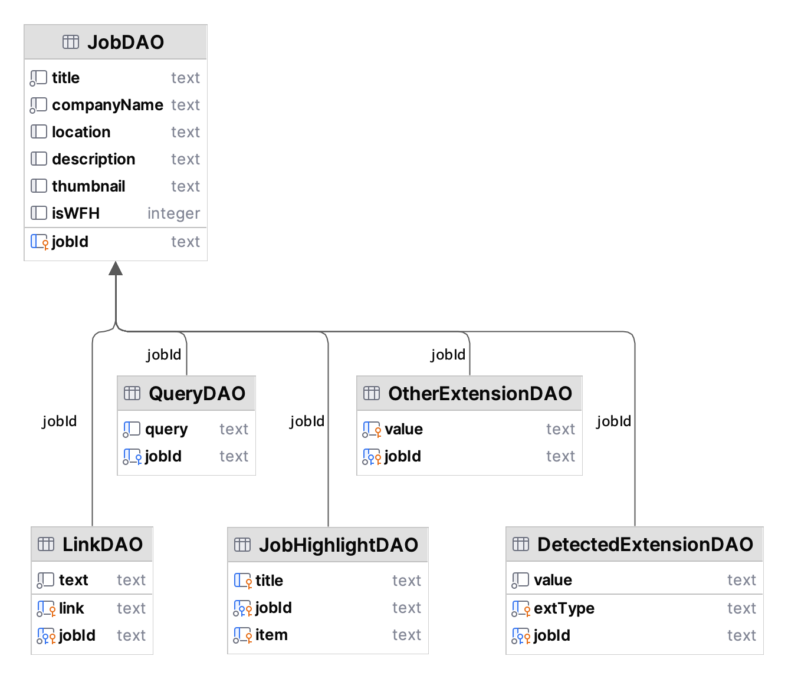

# Project 1 - Jobs Data

[](https://github.com/npmanos/nmanos-comp490-jobs-project/actions/workflows/gradle.yml) [](https://github.com/npmanos/nmanos-comp490-jobs-project/actions/workflows/super-linter.yml)

Author: Nick Manos

A small utility to saves job search results from an Excel file and 50 results from a Google job search to a database
then write them all to a formatted text file.

## Installation

### Requirements

- [JDK 21](https://adoptium.net/marketplace/?version=21)
- [SerpApi API Key](https://serpapi.com/)
- [Jobs Excel File](data/Sprint3Data.xlsx) - This workbook **must** contain a sheet named `Comp490 Jobs` with the
  following column format:

> [!NOTE]
> Column headers **must** match the name and order and **must** be the first row.

| Company Name | Posting Age | Job Id | Country | Location | Publication Date | Salary Max | Salary Min | Salary Type | Job Title |
|:------------:|:-----------:|:------:|:-------:|:--------:|:----------------:|:----------:|:----------:|:-----------:|:---------:|

> [!TIP]
> A compatible spreadsheet is included with the software in the data folder and is used by default.

### Build Instructions

1. Clone the repo and open the project folder

   ```bash
   git clone https://github.com/npmanos/nmanos-comp490-jobs-project.git
   cd nmanos-comp490-jobs-project
   ```

2. Create the environment file

   ```bash
   cp sample.env .env
   ```

3. Add your SerpApi API key to the .env file

   ```text
   JOBSPROJ_API_KEY=your_key_here
   ```

4. Build the project

   ```bash
   ./gradlew installDist
   ```

## Usage

After building the project, run `dist/bin/job-search` in your terminal.

> [!IMPORTANT]
> There is a known bug which can cause file writing to take a long time. If the application seems to be frozen on
> `Saving file...`, please be patient.
>
> This may be partially resolved in v2.0.0+, but could still occur in certain circumstances.

```text
dist/bin/job-search --help

Usage: job-search [<options>]

  This application saves job search results from <excel> and 50 results from a
  Google job search for <query> to <database> and writes them all to <output>.

  <excel> should contain a sheet named "Comp490 Jobs" using the following
  format:

  Company Name,Posting Age,Job Id,Country,Location,Publication Date,Salary
  Max,Salary Min,Salary Type,Job Title

  NOTE: Saving to <output> may take a few minutes. If the application seems
  frozen, please be patient.

  You can customize <excel>, <query>, <database>, and <output> using the options
  below.

Options:
  -x, --excel=<path>     Excel (.xls or .xlsx) file location (default:
                         data/Sprint3Data.xlsx)
  -q, --query=<text>     Job search query (default: software engineer boston)
  -d, --database=<path>  Database file location (default: output/jobs.db)
  -o, --output=<path>    Output file location (default: output/jobs.txt)
  -V, --version          Display version information and exit
  -h, --help             Show this message and exit
```

## Database Structure

Each object in the `jobs_results` array of the API response is stored in the JobDAO table with `jobId` as the primary key,
except for the `job_highlights`, `related_links`, `extensions`, and `detected_extensions` arrays, which are stored in
their own tables using `jobId` as a foreign key in order to implement a many-to-one relationship. The QueryDAO table
tracks what searches returned a particular result also using a `jobId` foreign key many-to-one relationship.



## TODO

- [ ] Prove slow file writing has been fully resolved
  - [ ] Write a unit test to catch regressions